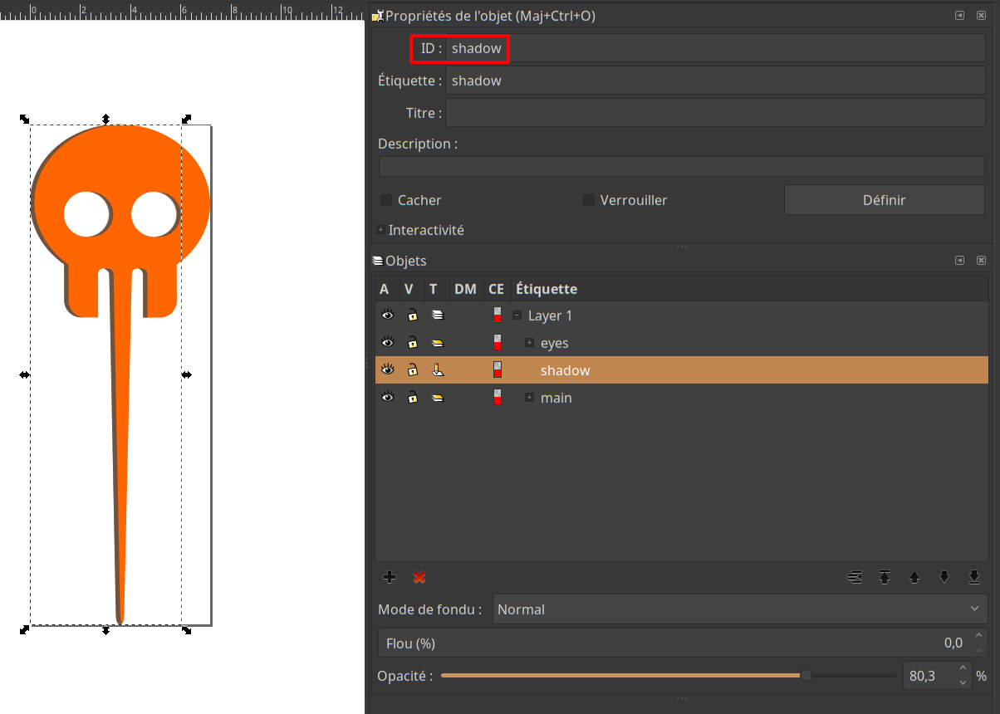
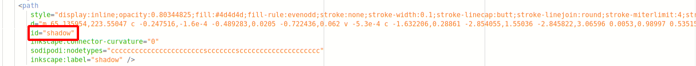
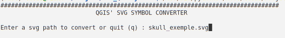
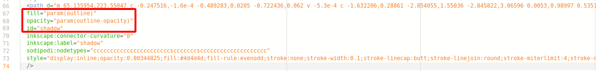

# 🗺️ QGIS SVG SYMBOL CONVERTER 

## ❔ Why using a QGis symbol converter ? 

In QGIS You can use your own custom SVG symbols. However, if you want to change your symbols caracteristics in the software, you will have to manually edit the SVG file to add QGis parameters as SVG attributes. When you're creating a custom symbol, you will often need to make some trials and errors. Thus, this editing step can be a waste of time. **This script aims to automate the step of adding QGis parameters as SVG attributes values to make them readable by QGis**.

## 🔎 Correspondence table between SVG and QGis

| SVG attribute   | QGis variable           |
|--               |--                       |
| opacity         | param(fill-opacity)     |
| stroke          | param(outline)          |
| stroke-width    | param(outline-width)    |
| stroke-opacity  | param(outline-opactiy)  | 
| fill            | param(fill)             |

> **_NOTE:_** In QGis, you can define only two colors/opacities as variables. One for the fill, and one for the outline. **But, you don't need to use them as intended**. Like the example below, you can use the outline color for the "fill" of another object, here the shadow object's fill color. 

## ⚙️ Requirements 

Made with `python 3.10`, not tested with other version. 
- `BeautifulSoup4` with  `xml` parser to parse and modify svg data ;
- `pyyaml` to store configuration and reuse it later. 

See `REQUIREMENTS.txt`. 

## 🚀 Steps 

### 1. **Choose or create your SVG symbol**. 

If you create your own SVG file, make sure to identify properly the parts/objects within your SVG with a clear ID. 

*Here is a example of a skull marker 💀 I created with inkscape for a zombi map project. In inkscape, to identify your object, go to `object>object proprety`. Edit the `ID` and click the `define` button.*



### 2. Open your SVG file in a text editor and **search the values of ids attributes** from the parts of your SVG file that you want to convert. (If you didn't define them yourself)




### 3. Attributes and values configuration

**Create a `.yml` file in the same directory and with the same name than your SVG file**. Edit it with the attributes you want to use in QGis as shown belown in the example with : 
 - **SVG object ID** as first level key ;
   - then **SVG attributes** as second level keys **:** and **QGis parameter** as value.

*Example* :  YAML file to modify two objects in the SVG file. First, the object with `id='main'` with QGis parameters : `fill` and `fill-opacity`. Second, the object with`id=shadow` with `outline-color` and `outline-opacity`.

```yaml
# svg_example.yml
main: 
  fill : param(fill)
  opacity: param(fill-opacity)

shadow: 
  fill : param(outline)
  opacity: param(outline-opacity)
```

### 4. Run the script

**Run the script `qgis_symbol_converter.py`** in your terminal and input your svg path to convert. Then exit the program by typing `q`.

*Script output in the terminal*



*Example of some attributes written by the script in the `path` tag with `id='shadow'` in the output `svg_example_qgis.svg` :*



### 5. **Use the output SVG file in QGis !**


## 🍻 Greetings 

Big thanks to **Klass Karlson** who inspired this script. Check out his [youtube tutorial](https://www.youtube.com/watch?v=6ZNesLmaJ0M&pp=ugMICgJmchABGAE%3D) which explained the whole "manual" methodology to create and use a custom symbol in QGis. Also, consider suscribing his channel. You will find a lot great tutorials about QGis tips and tricks to develop your mapping skills !


